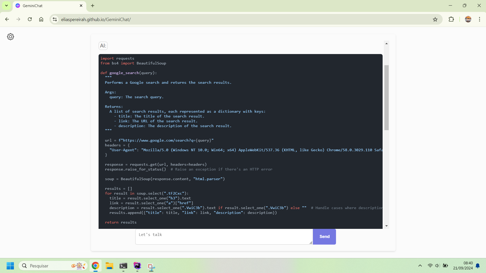

# GeminiChat: Open-Source Web Interface for Google's Gemini AI
**New:** Check out the new project to chat not only with Gemini but with several other models, whether from OpenAI, Groq, Ollama, Cohere or Anthropic https://github.com/EliasPereirah/OrionChat

New project link:  https://github.com/EliasPereirah/OrionChat


**GeminiChat** is an open-source, web-based application that allows you to interact with Google's powerful Gemini AI
seamlessly using your own API key.

## 🌟 Key Features

- 🚀 **Easy Setup**: Just add your Gemini API key and you're ready to start chatting.
- 💬 **Intuitive Interface**: A user-friendly chat interface for smooth interactions with Gemini AI.
- 🔒 **Secure**: Your API key is securely stored locally and never shared.
- 🎨 **Customizable**: Easily tweak the design and functionality to suit your preferences.
- 📱 **Responsive Design**: Optimized for both desktop and mobile devices.



## 🚀 Getting Started

### Prerequisites

- A valid Google Gemini API key. [Get your free API key here](https://aistudio.google.com/app/apikey).
- If you prefer not to install it locally, you can try the chat interface [here](https://eliaspereirah.github.io/GeminiChat/).

> 🔐 **Note**: Your API key is only sent directly to Google's servers and is not shared elsewhere.

### Installation

1. Clone this repository:
   ```bash
   git clone https://github.com/EliasPereirah/GeminiChat.git
   ```
2. Launch the app using a local server. Example: [http://localhost/GeminiChat](http://localhost/GeminiChat).

## 🛠️ Usage

1. Enter your Gemini API key in the provided field.
2. Start chatting with Gemini AI in the main interface.
3. Experience intelligent conversations powered by cutting-edge AI!

## 🤝 Contributing

We welcome contributions! Feel free to fork the repository, make changes, and submit a pull request. Let's improve this project together!

## 📄 License

This project is licensed under the MIT License. See the [LICENSE](LICENSE) file for more details.

## ⚠️ Disclaimer

This project is not affiliated with or officially endorsed by Google. Use of the Gemini AI API is subject to Google's terms and conditions.


